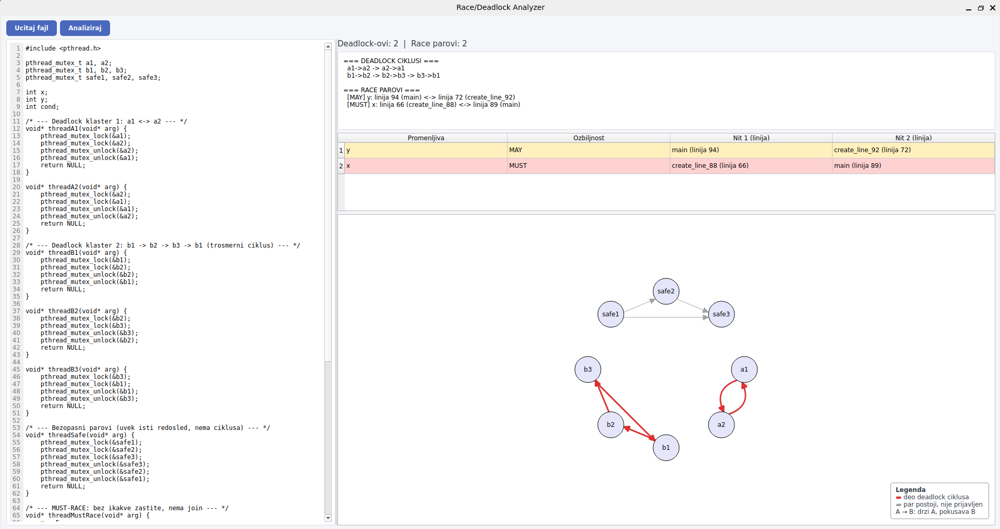

# Race & Deadlock Analyzer

Statički analizator za C programe koji koriste POSIX niti (`pthread`). Analizira izvorni kod
(bez izvršavanja) i prijavljuje:

- **Deadlock rizike** — cikluse u redosledu preuzimanja brava (`pthread_mutex_t`,
  `pthread_rwlock_t`, spinlock) između različitih niti.
- **Race uslove** — konkurentne, nezaštićene pristupe istoj deljenoj promenljivoj iz
  različitih niti, sa klasifikacijom ozbiljnosti (**MUST** — dokazano konkurentno i
  nezaštićeno, **MAY** — neizvesno u bar jednoj od te dve dimenzije).

> **Obim analize:** ne prati vrednosti promenljivih (grananje se posmatra kao da su moguće
> obe grane, bez obzira na stvarnu vrednost uslova) i ne prati pointer aliasing (`p = &x`,
> `q = p`) — ovo su namerne, dokumentovane granice, ne bagovi. Detaljnije u
> [Poznata ograničenja](#poznata-ograničenja).



## Sadržaj

- [Zavisnosti](#zavisnosti)
- [Build](#build)
- [Upotreba](#upotreba)
- [GUI](#gui)
- [Testovi](#testovi)
- [Struktura projekta](#struktura-projekta)
- [Kako analiza radi (ukratko)](#kako-analiza-radi-ukratko)
- [Poznata ograničenja](#poznata-ograničenja)
- [Reference](#reference)

## Zavisnosti

- CMake ≥ 3.20
- C++17 kompajler
- **LLVM i Clang**
- **Qt6** (komponenta `Widgets`)

Na Ubuntu/Debian sistemima, otprilike:

```bash
sudo apt install llvm-dev libclang-dev clang cmake qt6-base-dev
```

## Build

```bash
mkdir -p build
cd build
cmake ..
make
```

Ovo pravi tri izvršna fajla u `build/`:

- `analyzer` — komandno-linijski analizator
- `analyzer_gui` — grafički interfejs (Qt)
- `test_runner` — regresioni test paket

## Upotreba

```bash
./build/analyzer [--quiet] <putanja_do_c_fajla>
```

- Bez flagova: ispisuje AST/CFG dijagnostiku, sve parove zaključavanja i sve pristupe
  promenljivama, korisno za debagovanje same analize.
- `--quiet`: sažet čitljiv izlaz (`RACE`/`NO_RACE` i `DEADLOCK`/`SAFE` sekcije)

Primer:

```bash
./build/analyzer tests/deadlock/basic_deadlock.c
```

## GUI

```bash
./build/gui/analyzer_gui
```

Možete učitati test ili otkucati direktno.

## Testovi

```bash
./build/test_runner all              # svi testovi
./build/test_runner race             # samo testovi ciji fajl-path sadrzi "race"
./build/test_runner deadlock         # samo testovi ciji fajl-path sadrzi "deadlock"
```

Drugi argument je proizvoljan filter po podstringu putanje fajla (npr. `deadlock_safe`,
`kitchen_sink`). Testovi su C fajlovi u `tests/`, organizovani po očekivanom ishodu:

```
tests/
├── deadlock/         # fajlovi kod kojih SE OCEKUJE deadlock
├── deadlock_safe/     # fajlovi kod kojih se NE ocekuje deadlock
├── race/              # fajlovi kod kojih SE OCEKUJE race
├── race_safe/          # fajlovi kod kojih se NE ocekuje race
└── combined/          # kombinovani testovi (vise nezavisnih slucajeva u jednom fajlu)
```

Očekivani rezultati su definisani u `tests/test_runner.cpp` (lista `TestCase` struktura na
početku `main`-a).

## Struktura projekta

```
src/
├── main.cpp                     # ulazna tacka CLI alata
├── frontend/                    # Clang AST/CFG integracija (ASTConsumer, CallVisitor, ...)
└── analysis/
    ├── common/                  # deljena infrastruktura (deadlock + race)
    │   ├── InterproceduralWalker.* # CFG worklist/fixpoint obilazak, interproceduralna
    │   │                          # rekurzija, pthread_create/join knjigovodstvo
    │   ├── LockState.*            # stanje analize (May/Must lockset, aktivne niti, ...)
    │   ├── ConcurrencyExclusion.h  # "assumed concurrent unless proven otherwise" provere
    │   ├── ASTUtils.*              # izvlacenje imena promenljivih/brava iz AST izraza
    │   └── LockRecognition.*       # prepoznavanje pthread lock/unlock poziva
    ├── deadlock/                 # LockOrderAnalyzer (generisanje LockPair ivica),
    │                              # CycleDetector (DFS + Kroening-stil provere)
    └── race/                     # RaceAnalyzer (generisanje MemoryAccess zapisa),
                                   # RaceDetector (MUST/MAY klasifikacija)
gui/                              # Qt6 graficki interfejs
tests/                            # regresioni testovi + test_runner.cpp
```

## Kako analiza radi (ukratko)

### Deadlock — must/may lockset i traženje ciklusa

Dok pratimo kod jedne niti, za svaku tačku u programu pamtimo koje brave **sigurno** drži u
tom trenutku (**must lockset**) i koje **možda** drži (**may lockset**). Kad kod ima
grananje (`if`/`else`), na mestu gde se grane ponovo spajaju:

- must lockset radi **presek** — brava ostaje "sigurna" samo ako je bila držana na OBE grane
- may lockset radi **uniju** — brava ulazi kao "moguća" ako je bila držana na BAR JEDNOJ grani

Ovaj must/may pristup je preuzet iz Kroeninga-a [1] (videti [Reference](#reference)).

Kad neka nit uzme novu bravu dok već drži neku drugu, to beležimo kao ivicu u grafu:
"dok se drži brava A, uzima se brava B". Nad tim grafom tražimo cikluse (npr. A→B→A) — svaki
pronađeni ciklus je **kandidat** za deadlock, ne odmah potvrđen deadlock.

Svaki kandidat zatim prolazi kroz proveru po uzoru na Kroening et al. [1], koja odbacuje
lažne kandidate:

- ako sve brave u ciklusu drži ista nit (sekvencijalno, ne konkurentno), to nije deadlock —
  osim ako je ta nit kreirana u petlji (tad ista "nit" može predstavljati više pravih niti)
- ako dva dela ciklusa dele bravu koju obe strane sigurno drže, ta brava razbija ciklus
- ako se u ciklusu sudaraju dva čitaoca (`rdlock`/`rdlock`), to fizički ne može biti
  deadlock — više čitalaca sme da čeka isto
- ako je dokazano da dva dela ciklusa nisu mogla da se dese u isto vreme (npr. jedna nit je
  već sačekana pre nego što je druga i počela), ciklus se odbacuje

Ono što preživi sve provere prijavljujemo kao stvaran deadlock rizik.

### Race — isti must/may princip, ali na dva različita pitanja

Kod race analize koristimo must/may pristup dva puta, za dva odvojena pitanja:

1. **Da li su dva pristupa uopšte mogla da se dese u isto vreme?** Za ovo pratimo koje su
   niti **sigurno** (must) odnosno **možda** (may) aktivne (kreirane, a još nisu joinovane) u
   trenutku pristupa.
2. **Da li je pristup zaštićen bravom?** Za ovo koristimo isti must/may lockset mehanizam
   kao kod deadlock-a — **must** znači da OBE strane SIGURNO drže istu
   bravu na svakoj grani, **may** znači da je bar na nekoj grani MOŽDA delе.

Pre nego što uopšte gledamo ozbiljnost, par se u potpunosti odbacuje (ne prijavljuje se ni
kao MAY-RACE) ako je odgovor na bilo koje od ova dva pitanja **negativan sa sigurnošću** —
tj. ako je dokazano da OBE strane sigurno dele bravu (must-protected), ili ako je dokazano
da niti nisu mogle biti aktivne u isto vreme (npr. jedna nit je već sačekana pre nego što je
druga i počela).

Ako par preživi to odbacivanje, kombinacija odgovora na ta dva pitanja daje ozbiljnost
preživelog nalaza — sama MUST/MAY klasifikacija (ne i lockset mehanizam ispod nje) preuzeta
je iz RacerF-a [2]:

- **MUST-RACE** — DOKAZANO da su niti bile aktivne u isto vreme, I DOKAZANO da nijedna
  zajednička brava nije štitila pristup ni na jednoj grani
- **MAY-RACE** — bar jedno od to dvoje je samo moguće, ne dokazano (npr. nit se možda uopšte
  nije ni kreirala, ili se brava možda delila na nekoj grani, ali ne na svakoj)

## Poznata ograničenja

Analiza ne prati vrednosti promenljivih (npr. `if (cond) ... else ...` se uvek posmatra kao
obe grane moguće, bez obzira na stvarnu vrednost `cond`) niti prati pointer aliasing (`p = &x`,
`q = p`) — lokalna promenljiva čija adresa "pobegne" kroz argument funkcije se ne prepoznaje
kao deljena. Ovo su namerne, dokumentovane granice obima projekta, ne bagovi.

## Reference

Metodologija se oslanja na sledeće radove:

1. Daniel Kroening, Daniel Poetzl, Peter Schrammel, Björn Wachter. **Sound Static Deadlock
   Analysis for C/Pthreads.** In _Proceedings of the 31st IEEE/ACM International Conference
   on Automated Software Engineering (ASE 2016)_, pp. 379–390.
2. Tomáš Dacík, Tomáš Vojnar. **RacerF: Lightweight Static Data Race Detection for C Code.**
   In _39th European Conference on Object-Oriented Programming (ECOOP 2025)_, LIPIcs vol. 333,
   pp. 37:1–37:19. doi:10.4230/LIPIcs.ECOOP.2025.37
